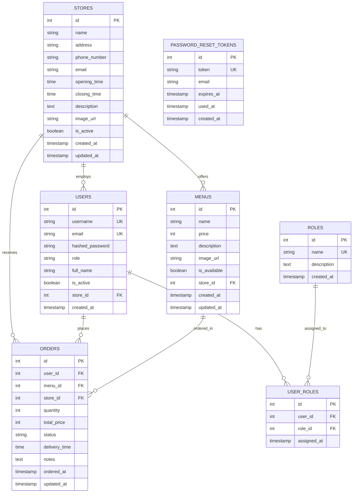

# データベーススキーマ - ER図

## テーブル説明

### STORES (店舗テーブル)
- 各店舗の基本情報を管理
- メニュー、注文、ユーザー(店舗スタッフ)と紐付け
- マルチテナント対応の中核テーブル

### USERS (ユーザーテーブル)
- お客様と店舗スタッフの両方を管理
- `role`: 'customer' または 'store'
- `store_id`: 店舗スタッフの場合のみ設定

### ROLES (役割テーブル)
- 店舗スタッフの職位管理: owner, manager, staff

### USER_ROLES (ユーザー役割紐付けテーブル)
- ユーザーと役割のN対N関係を管理

### MENUS (メニューテーブル)
- 各店舗が提供するメニュー
- `store_id`: 所属店舗 (必須)

### ORDERS (注文テーブル)
- お客様の注文情報
- `store_id`: 注文先店舗 (必須)
- `user_id`: 注文者
- `menu_id`: 注文メニュー

### PASSWORD_RESET_TOKENS (パスワードリセットトークンテーブル)
- パスワードリセット用のトークン管理
- 有効期限と使用状態を追跡

## 外部キー制約

| 子テーブル | 外部キー | 参照先 | ON DELETE |
|-----------|---------|--------|-----------|
| users | store_id | stores.id | SET NULL |
| user_roles | user_id | users.id | CASCADE |
| user_roles | role_id | roles.id | CASCADE |
| menus | store_id | stores.id | CASCADE |
| orders | user_id | users.id | - |
| orders | menu_id | menus.id | - |
| orders | store_id | stores.id | CASCADE |

## マルチテナント対応

- **店舗分離**: `store_id`により、メニューと注文を店舗ごとに完全分離
- **アクセス制御**: 各店舗スタッフは自店舗のデータのみアクセス可能
- **お客様**: 全店舗のメニューを閲覧・注文可能（`users.store_id`はNULL）
